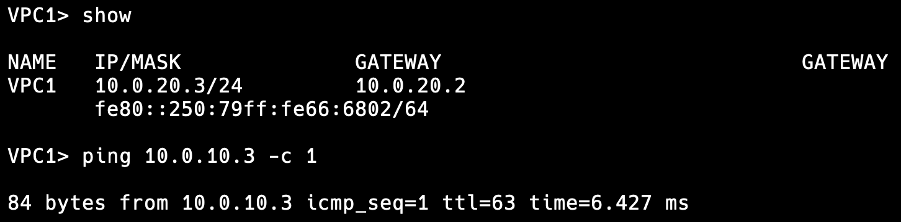

# Lab1

Схематично сеть выглядит так:

Экспорт лабы из EVE-NG можно найти в [этом](_Exports_unetlab_export-20240616-170752.zip) файле.

## Описание конфигураций

Вместо того, чтобы долго описывать настройку словами, кажется, что проще приложить скриншоты со всеми настройками и проверкой доступности VPC:

### Первый клиент (VPC0):

Здесь в качестве gateway используется адрес коммутатора-ядра сети, чтобы достигнуть отказоустойчивости на случай падения роутера.

Адрес `10.0.10.1`, VLAN `10`.

### Второй клиент (VPC1):

С gateway аналогично.

Адрес `10.0.20.1`, VLAN `20`.

### Первый коммутатор доступа (Switch0):

Доступ ко второму коммутатору ограничен с помощью режима trunk с `allowed vlan none`.

### Второй коммутатор доступа (Switch1):

Доступ к первому коммутатору ограничен аналогичным образом.

### Коммутатор, ядро сети (SwitchMain):

Адрес `10.0.10.2` для VLAN `10` и `10.0.20.2` для VLAN `20`.

### Маршрутизатор (Router):

Адрес `10.0.10.1` для VLAN `10` и `10.0.20.1` для VLAN `20`.
